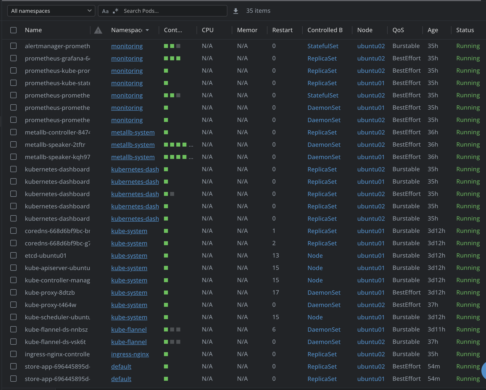
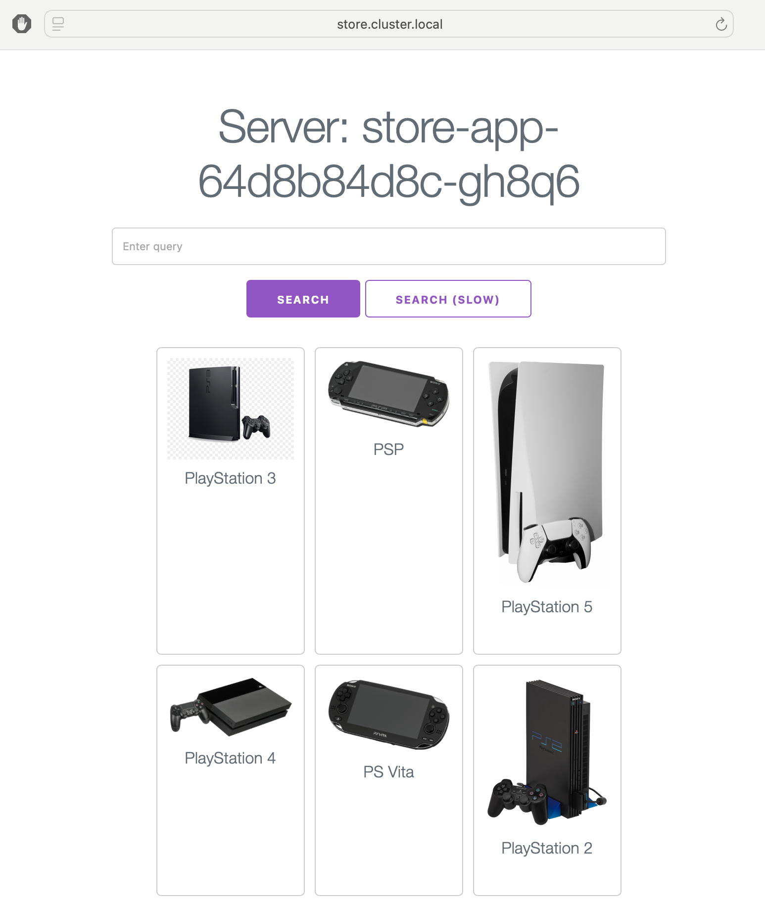
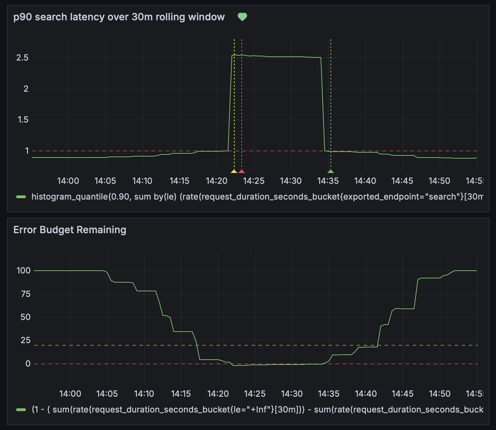

# Homework Assignment

## Project Overview

This is an online store written in Go. Its key functionality is search and the SLO around this functionality is defined below. There is a simulation of slow search request implemented for test purposes. The application is deployed to my home server Kubernetes cluster with the helm chart provided in this repo. The application is instrumented to expose metrics to Prometheus. Grafana is used to visualize the SLO, Error Budget and to trigger alerts when the SLO is not met. ```kube-prometheus-stack``` was used to deploy Prometheus and Grafana to the cluster. JSON models of Grafana Alert Rules and Dashboards are located in ```grafana/```

## SLI Definition

The proportion of search requests which were fullfilled sufficiently fast, as measured by the application backend endpoint.

## SLO Definition

90% of search requests took ≤ 1 second to fullfil over a 30-minute rolling window.

## End-to-end demo

I suggest to review the assignment end-to-end during the technical interview. However, below you may find screenshots of its live action.


*Store app and kube-prometheus-stack pods running in the cluster*



*Store application with simulation of slow search*



*Grafana dashboard*


## Notes

- The numbers used for the SLO in this project (90th percentile, 1 second latency and 30-minute window) are quite far away from the real-world scenarios, but were used here for ease of testing and demonstration.
- The ability to provision the necessary infrastructure and deploy the app in 1-click would be nice here, but was not included in the scope due to task time limitations.